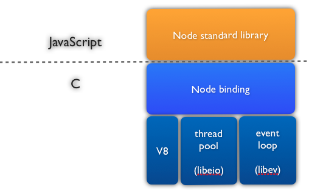

# Node.js 아키텍처

Node.js의 아키텍터(Architecture)

## V8
> 자바스크립트 엔진 (인터프리터)
### libeio
이벤트 기반의 모든 게 비동기로 동작하는 C언어용 I/O 라이브러리 입니다.
기본적으로 POSIX API에 기반을 두고 있으며 파일 처리 관련 작업을 합니다.
read, write, open, close, stat, unlink, fdatasync, mknode, readdir 등 의 작업을 비동기로 처리합니다.
### libev
다양한 기능을 가진 고성능 니벤트 루프 라이브러리입니다. libevent를 따라 느슨하게 모델링 되었지만 이전에 존재했던 버그나 제한사항이 없습니다. 프로세스 감시, 절대시각에 기반한 주기적 타이머, 그리고 epoll / kqueue / event ports / inotify / eventfd / signalfd 등을 지원합니다. POSIX 라이브러리입니다.
### Node binding
node 표준 라이브리라와의 인터페이스 역할을 합니다.

## Event driven async I/O
> 보통 서버 프로그래밍에 사용되는 언어나 플랫폼은 동기 방식의 I/O를 주로 사용하지만, node의 모든 I/O는 비동기로 실행됩니다. 물론 대부분의 언어나 플랫폼에서도 비동기 방식의 I/O를 사용할 수 있지만, 동기 I/O 만큼 많이 사용하지는 않습니다.
node의 I/O는 이벤트 루프를 토대로 비동기로 실행되므로 I/O의 결과를 직접 돌려받는 대신 콜백 함수의 파라미터로 전달받습니다. 일부 API는 동기로 사용할 수 있지만, 대부분의 API는 비동기 방식으로 동작합니다.

## Sing trhead
> node의 이벤트 루프는 싱글 쓰레드에 싱글 스택을 사용합니다. 이것은 코드를 실행하는 쓰레드가 오직 하나이기 때문에 쓰레드 동기화에 대한 고민을 할 필요가 없다는 의미입니다.
싱글 쓰레드는 직접 장성한 코드만 동기로 실행하고 그 외 나머지 모든 I/O는 비동기로 처리합니다. 비동기로 처리한 I/O가 완료되었다는 이벤트가 발생해도 현재 스텍에 존재하는 이벤트를 처리한 후에 다음 이벤트를 처리합니다.
주의할 점은, 현재 쓰레드가 처리 중인 작업이 CPU 처리량이 많아 오래 걸린다면 다른 이벤트가 처리되지 않는다는 점입니다.
참고로, node가 싱글쓰레드로 실행된다는 것은 개발자가 작성한 코드를 처리하는 쓰레드가 하나라는 의미이지, node 아키텍처 전체에서 실행되는 쓰레드가 하나라는 의미는 아닙니다. 이런 작업은 node 내부에서 처리되므로 개발자는 싱결쓸 필요가 없습니다.